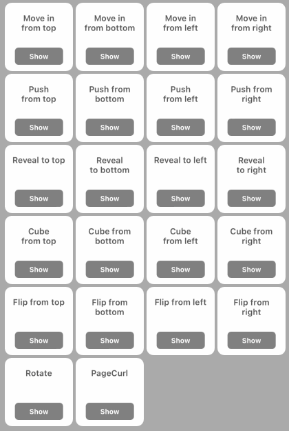

# UIViewAnimation

## Description

UIViewAmination is an animation extension of UIView. It provides several animations.

## Installation

CocoaPods

```
# Podfile
use_frameworks!

target 'YOUR_TARGET_NAME' do
    pod 'UIViewAnimation', '~> 2.0.0'
end
```

## How to use

- Import the UIViewAnimation in the file

```swift
	import UIViewAnimation
```

- Use the view instance to execute the animation method

```swift
	let view = UIView()
	
	// Call the animation you want as below
	view.animationFlipFromRight()
	
	view.animationPageCurl()
	
	view.animationCubeFromTop()
	
	view.animationRotate()
```




## License
The source code is distributed under the nonviral [MIT License](https://opensource.org/licenses/mit-license.php). It's the simplest most permissive license available.

## Version History

 - v1.0.0: Nov 13 2018
	 - [NEW] The first version.